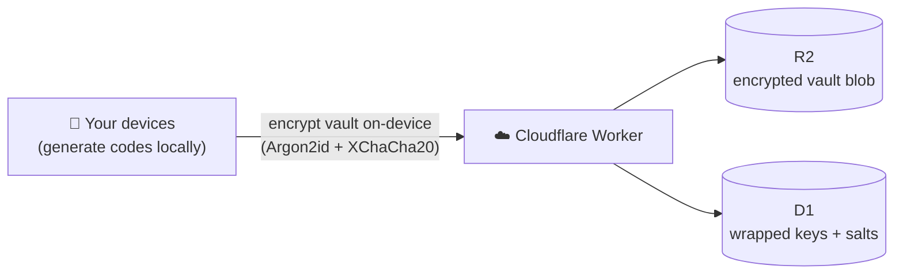

<div align="center">

# 🔐 OTPVault

**A free, open-source 2FA authenticator with end-to-end-encrypted cloud sync — on every device you own.**

[](./LICENSE)


</div>

> Your TOTP codes, synced across **iOS, Android, macOS, Windows and the web** — encrypted so that **not even the server can read them**. No ads, no subscriptions, no lifetime trap.

<!-- Add a real screenshot here once the UI lands:  -->
> 📸 _Screenshots coming soon — the app is at Phase 0 (see [Roadmap](#roadmap))._

---

## Why OTPVault

- 🔒 **Zero-knowledge.** Your vault is encrypted on your device with a key derived from your master password. The server only ever stores ciphertext — a breach leaks nothing usable.
- 📱 **Truly cross-platform.** One codebase → iOS, Android, macOS, Windows, and web.
- 🆓 **Free forever for individuals.** The whole backend runs on Cloudflare's free tier; it costs nothing to host at real-world scale.
- 🔑 **You'll never get locked out.** A one-time **recovery key** and **passphrase-encrypted exports** mean a forgotten password never means a lost vault.
- 🧩 **Open source (AGPL-3.0).** Audit it, fork it, or self-host the sync backend yourself.

## How it works

Codes are generated **on-device**. The vault is sealed with a random key that is itself only stored *wrapped* — unlockable by your password **or** your recovery key. The server is a dumb encrypted-blob store.



The server holds no key and can decrypt nothing. Full design: **[PLAN.md](./PLAN.md)** · security & recovery model: **[PLAN.md §7](./PLAN.md#7-security-model--recovery)**.

## Repository

| Path | What |
|---|---|
| [`app/`](./app) | Flutter client (iOS · Android · macOS · Windows · web) — TOTP engine, envelope crypto, encrypted backup, sync client, UI |
| [`backend/`](./backend) | Cloudflare Worker (Hono + D1 + R2) — the zero-knowledge sync API |
| [`PLAN.md`](./PLAN.md) | Architecture, free-tier sizing, security/recovery model, roadmap |

## Getting started

```bash
# Backend (Cloudflare Worker)
cd backend
npm install
wrangler d1 create twofa          # paste the id into wrangler.toml
wrangler r2 bucket create twofa-vaults
npm run db:init:local
npm run dev

# Client (Flutter)
cd app
flutter create . --platforms=ios,android,macos,windows,web --project-name twofa
flutter pub get
flutter run -d macos              # or windows / chrome / <device>
```

Point the app at your Worker by setting `kSyncBaseUrl` in `app/lib/config.dart`.

## Roadmap

- **Phase 0 — Local-only authenticator** *(current)* — QR import, code generation, biometric unlock. Useful with no backend at all.
- **Phase 1 — Encrypted sync** — signup/login, whole-vault E2E sync, conflict handling.
- **Phase 2 — Multi-device polish** — new-device onboarding, recovery flow, passkeys.

## Security

Please **do not** open public issues for vulnerabilities — email the maintainer instead (see profile). Crypto: Argon2id key derivation, XChaCha20-Poly1305 authenticated encryption, an envelope key model with password + recovery-key wrappers. Independent review is very welcome.

## Contributing

Early days — issues, ideas, and PRs are welcome. Please read `PLAN.md` first so changes fit the zero-knowledge design.

## License

[**AGPL-3.0**](./LICENSE) — free to use, modify, and self-host; anyone distributing a modified version (including as a hosted service) must release their source under the same terms. The copyright holder reserves the right to offer separate commercial licenses for organizations that cannot meet the AGPL's terms.
